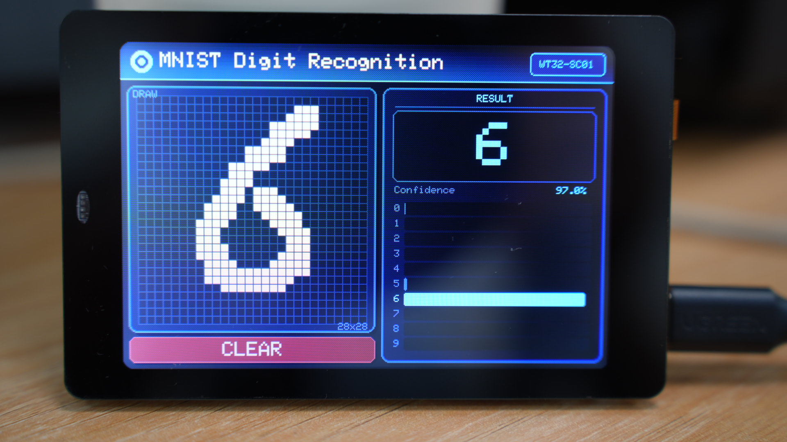
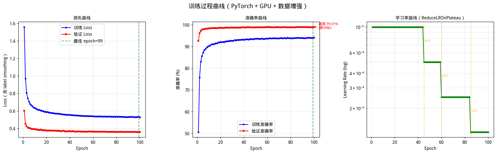
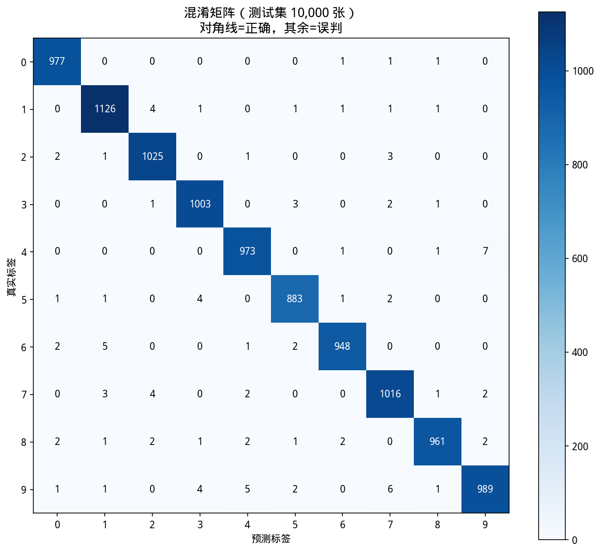
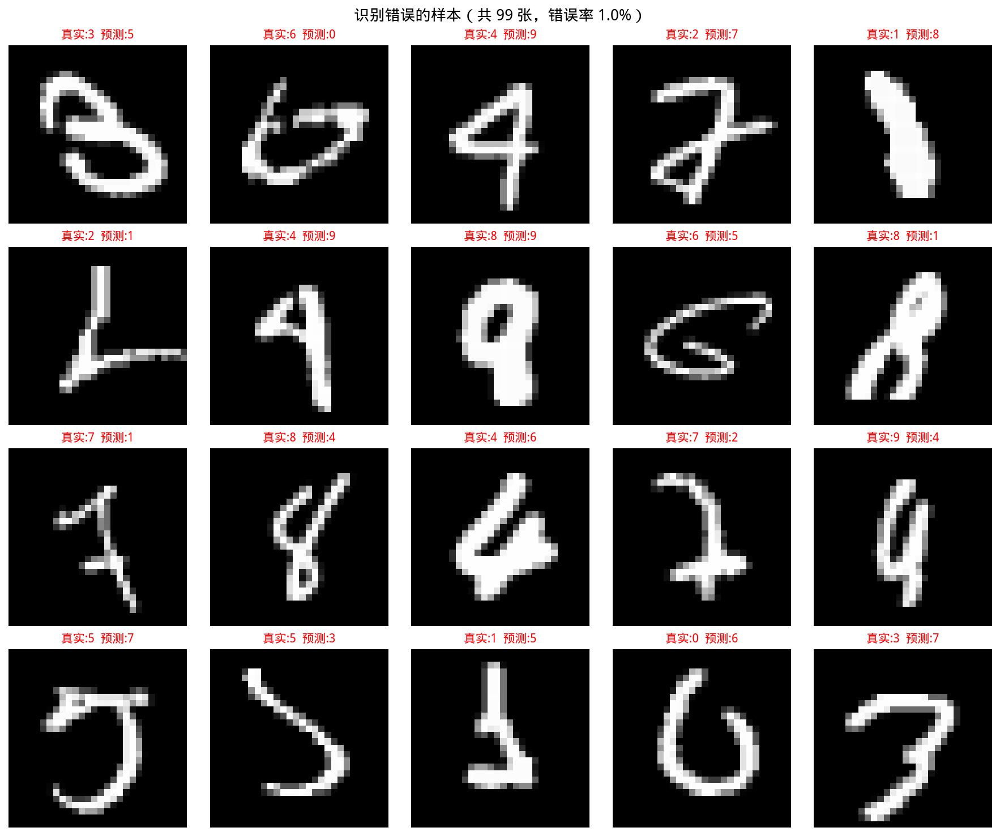
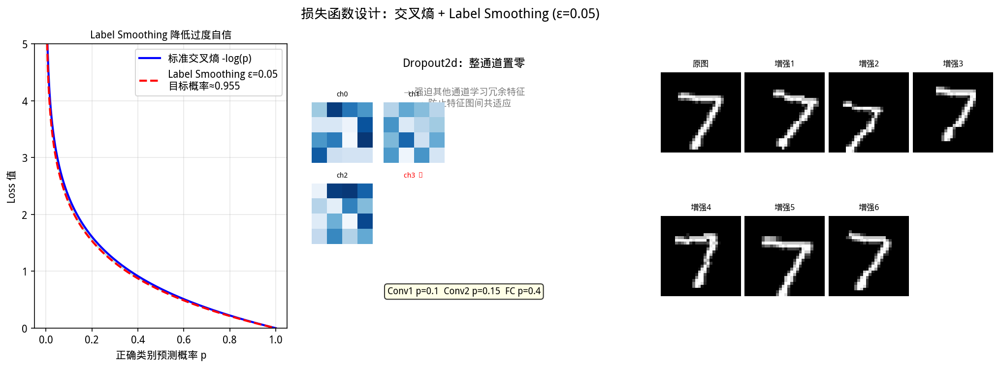
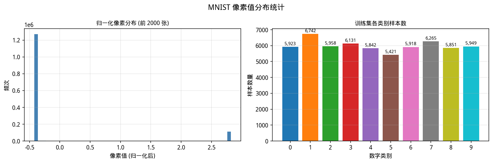
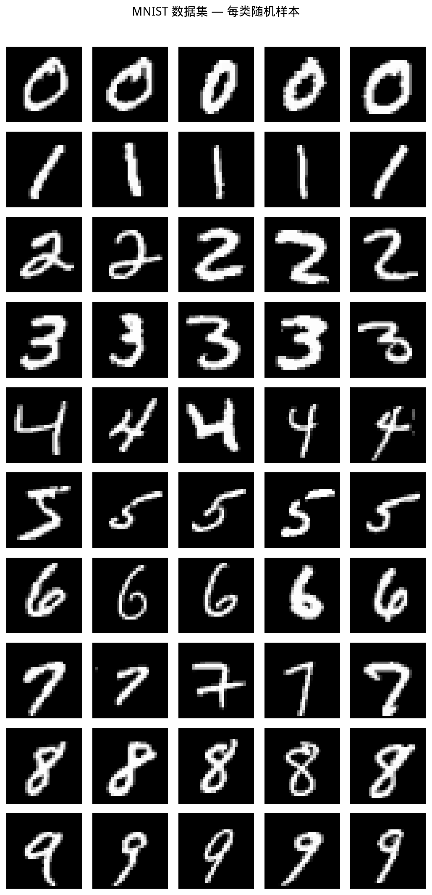
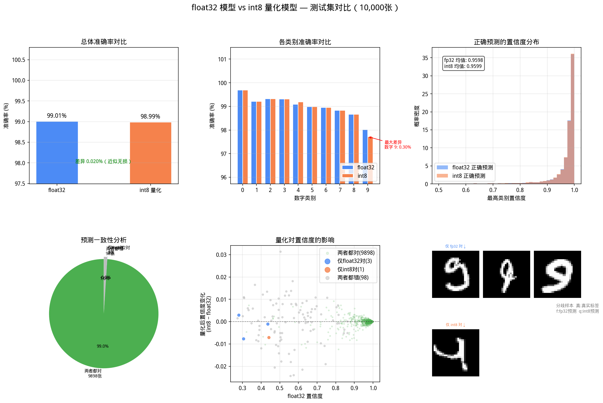

# ESP-Net: MNIST Digit Recognition on ESP32

[](https://www.espressif.com/en/products/socs/esp32)
[](https://www.arduino.cc/)
[](https://pytorch.org/)
[](https://github.com/lovyan03/LovyanGFX)

A high-performance, lightweight CNN pipeline for handwritten digit recognition on embedded systems. This project covers the entire lifecycle from GPU-accelerated training on PC to optimized deployment on a WT32-SC01 (ESP32) touch screen device.

## 📺 Showcase

### Project Demo

<div align="center">
  
  <p><i>Real-time handwritten digit recognition on WT32-SC01</i></p>
  <p><b>📺 <a href="https://www.bilibili.com/video/BV12XdBBdEAA/">点击此处前往 Bilibili 观看完整高清演示视频</a></b></p>
</div>

### Featured UI

<div align="center">
  
  <p><i>（Modern, tech-style UI with real-time probability distribution.）</i></p>
</div>

---

## 🌟 Key Features

- **Full-Stack AIoT**: Includes data downloading, GPU-accelerated training, weight quantization, and embedded deployment.
- **Custom Inference Engine**: Hand-written C++ CNN operators (`nn_ops.cpp`) optimized for ESP32, avoiding the overhead of heavy frameworks like TFLite Micro.
- **Int8 Quantization**: Model weights are quantized to `int8` with per-tensor scaling to minimize memory footprint while maintaining high accuracy.
- **Sophisticated UI**: Interactive 28x28 drawing grid with real-time probability bar charts, powered by LovyanGFX.
- **Robust Training**: PyTorch pipeline with data augmentation (rotation ±10°, translation, scaling, random erasing) and early stopping.

> ⚠️ **Input Orientation Requirement**: The model is trained on the standard MNIST dataset where all digits are **upright**. The data augmentation only covers small rotations (±10°). Therefore, you **must write digits in the normal upright orientation**. Writing at large angles (e.g., 90° or 180° rotated) will result in incorrect recognition.

---

## 📊 Model & Training Performance

The model follows a lightweight CNN architecture:
`Conv2D(8, 3x3) -> BN -> ReLU -> MaxPool -> Conv2D(16, 3x3) -> BN -> ReLU -> MaxPool -> Flatten -> Dense(64) -> Dense(10)`

### Training Progress
The training pipeline features automated learning rate reduction and early stopping to ensure optimal convergence.



### Model Evaluation
The model achieves high accuracy on the MNIST test set, as shown by the confusion matrix and error analysis.

| Confusion Matrix | Error Analysis |
| :---: | :---: |
|  |  |

---

## 🛠️ Hardware Requirements

- **Module**: [WT32-SC01](http://www.wireless-tag.com/portfolio/wt32-sc01/) (ESP32-WROVER-B)
- **Display**: 3.5-inch 320x480 Capacitive Multi-touch Screen
- **Memory**: 4MB External PSRAM (utilized for UI and activations)

---

## 🚀 Getting Started

### 1. Training & Exporting
```bash
# 1. Download MNIST dataset
python download_mnist.py

# 2. Train the model (requires PyTorch & CUDA for best performance)
python train_mcu.py

# 3. Export weights to model_weights.h
python export_weights.py
```

### 2. ESP32 Deployment
The firmware is built using **PlatformIO**.

1. Open the `LVGL8-WT32-SC01-Arduino` folder in VS Code with the PlatformIO extension.
2. Ensure `model_weights.h` (generated in step 1.3) is copied to `src/`.
3. Connect your WT32-SC01 and click **Upload**.

---

## 🔬 Technical Implementation Details

### Lightweight Inference (`nn_ops.h`)
The inference engine implements the following operators from scratch:
- `nn_conv2d_same`: 3x3 convolution with SAME padding and `int8` weights.
- `nn_batchnorm`: Batch normalization folded into scales and biases for zero runtime overhead.
- `nn_maxpool2d`: 2x2 max pooling.
- `nn_dense`: Fully connected layer with ReLU/Softmax activation.

### Memory Optimization
Activations are managed in a double-buffer strategy to minimize peak memory usage, fitting well within the ESP32's internal DRAM (~31 KB for activation buffers).


*Visualizing the design philosophy behind the optimization.*

---

## 🎨 Visualization Gallery

| Data Distribution | Sample Digits | Model Comparison |
| :---: | :---: | :---: |
|  |  |  |

---

## 📜 License
MIT License. Feel free to use this for your own geeky projects!
